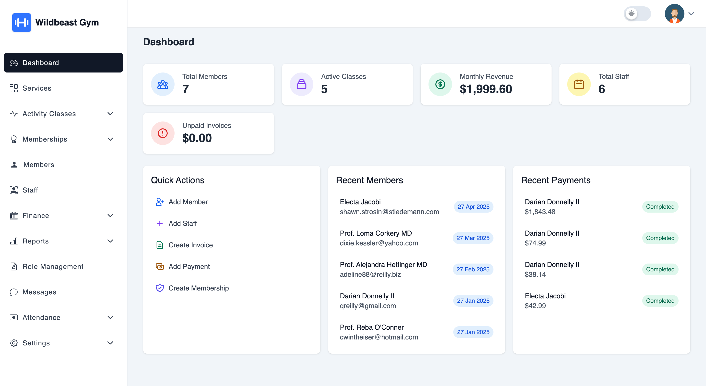
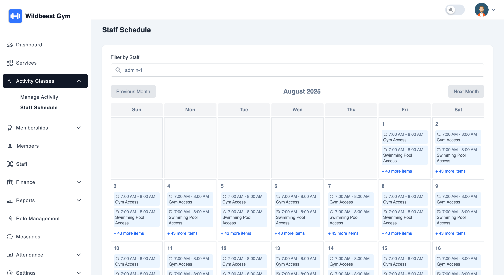
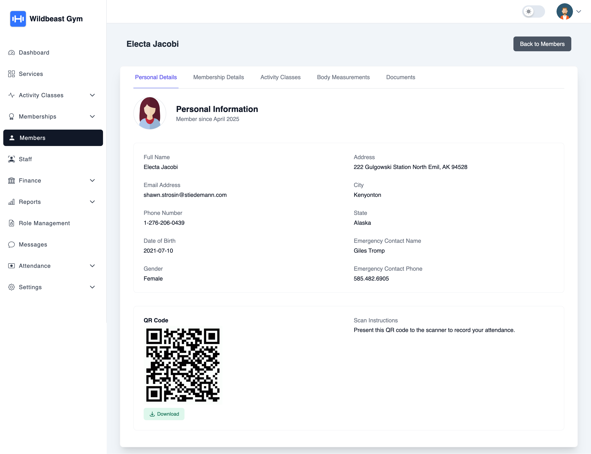

# 🏋️‍♀️ Trainzy - Open Source Gym Management Software

**Trainzy** is a modern, open-source **Gym Management System** built with Laravel, Livewire, TailwindCSS, and MySQL — designed to simplify how gyms manage members, staff, classes, attendance, and progress tracking.

It’s ideal for developers and businesses looking to self-host or customize their own gym solution — and we also offer a full-featured SaaS version for those who want a hosted plug-and-play option.

---

## 🌐 Live Demos

| Version | Demo Link | Access Info |
|--------|------------|-------------|
| 🆓 **Open Source (Public Demo)** | [https://demo.trainzy.fit](https://demo.trainzy.fit) | *Sample login credentials provided on login screen* |
| 💼 **SaaS Edition Demo** | [https://trainzy.fit](https://trainzy.fit) | *Public-facing gym listing, offers, and features* |

---

## 🌟 Core Features (Open Source)

- 👥 Member & Staff Management  
- 📆 Class Scheduling (Calendly-style slots)  
- 🔁 Membership Auto-Renewal  
- 📩 Email Notifications  
- 📊 Body Measurements & Fitness Progress  
- 🔐 Roles & Permissions with Spatie  
- 🧾 Invoicing with Discounts & Tax Logic  
- 📄 Export to PDF/CSV  
- 📅 Holiday, Staff Leave & Exceptions  
- 💻 Built with Laravel, Livewire, TailwindCSS  

---

## 🚀 SaaS Edition – Premium Features

The **SaaS version** of Trainzy is a **commercially licensed**, hosted solution with additional advanced features — available as a **private GitHub repo** upon purchase.

### 🔓 Premium-Only Highlights

- 🌍 **Public Gym Listing Page**
  - Gym search by city, activities, amenities  
  - 💬 Reviews, Ratings & Photos  
  - 🎯 Sponsored Gym Listings  
  - 🎁 Offer Promotions & Free Trials  
- 💳 Stripe Payment Integration  
- 🧍 Slot Capacity, Waitlist, and Attendance  
- 🔔 Advanced Notifications & Scheduling  
- 📱 Mobile-Optimized UI  
- ⚙️ Admin Branding & Settings Panel  
- 📈 Revenue & Activity Analytics  
- 📦 Ongoing Updates + Priority Support

📌 **View SaaS Demo:** [https://trainzy.fit](https://trainzy.fit)  
📬 **Buy the SaaS Codebase:** Email [hello@trainzy.fit](mailto:hello@trainzy.fit)

---

## 🧑‍💻 Tech Stack

- **Backend:** Laravel 10+, Livewire  
- **Frontend:** TailwindCSS, Alpine.js  
- **Database:** MySQL  
- **Export/Barcode Tools:** DOMPDF, Simple-QRCodes, milon/barcode  
- **Access Control:** Spatie Permissions  

---

## 🛠️ Installation (Open Source)

1. **Clone the Repository**

```bash
git clone git@github.com:ritabala/trainzy.git
cd trainzy
```

2. **Install Dependencies**

```bash
composer install
npm install && npm run build
```

3. **Setup Environment**

```bash
cp .env.example .env
php artisan key:generate
```

4. **Run Migrations and Seeders**

```bash
php artisan migrate --seed
```

5. **Start Development Server**

```bash
php artisan serve
```

---

## 📸 Screenshots

| Dashboard | Class Scheduler | Member Profile |
|----------|------------------|----------------|
|  |  |  |

---

## 🙌 Contributing

We welcome contributions from the community:

- Fork the repo  
- Create a feature branch  
- Commit and push your changes  
- Submit a Pull Request

See [CONTRIBUTING.md](CONTRIBUTING.md) for full details.

---

## 📄 License

- 🆓 **Open Source Edition** — MIT License  
- 💼 **SaaS Edition** — Commercial license (paid access only)  
  - Redistribution or resale prohibited  
  - Includes lifetime updates + private GitHub access

---

## 📬 Contact & Support

- 🌐 Website: [https://trainzy.fit](https://trainzy.fit)  
- 📧 Email: [hello@trainzy.fit](mailto:hello@trainzy.fit)

---

## ⭐ Support the Project

If you find Trainzy helpful:

- 🌟 Star this repo  
- 💬 Share with your network  
- 💼 Upgrade to [Trainzy SaaS](https://trainzy.fit) to support continued development

---

> © 2025 Trainzy. Built with 💪 for gyms, developers, and fitness tech innovators.
